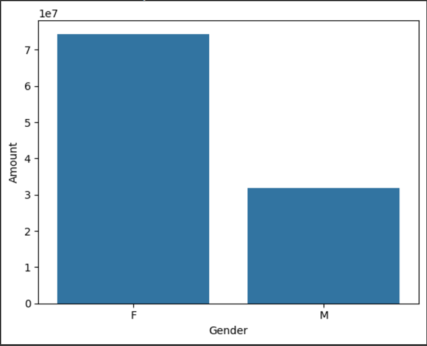
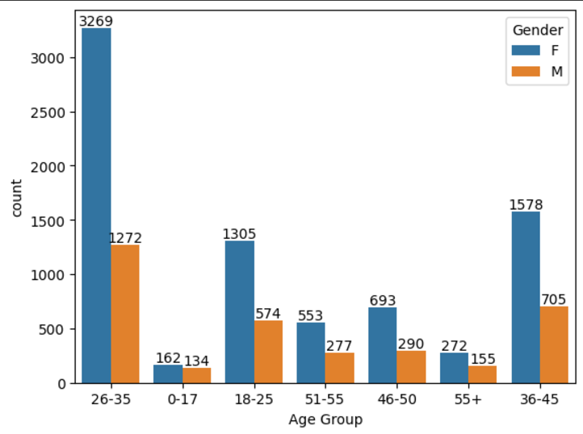
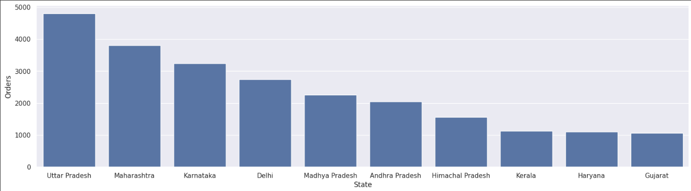
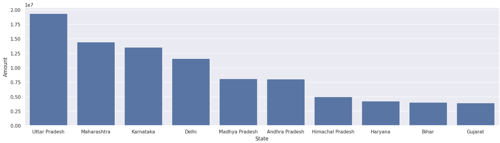
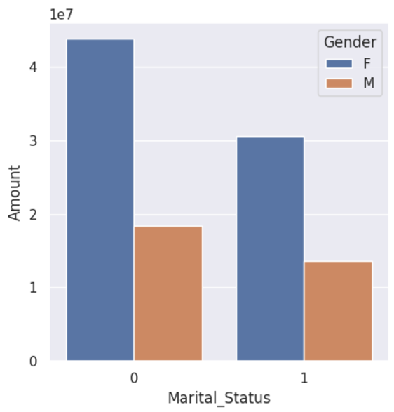
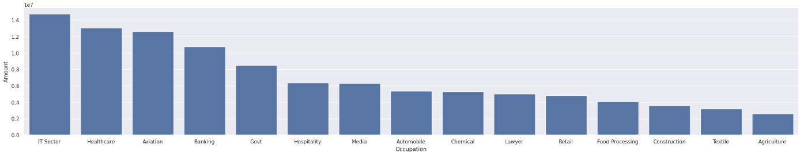
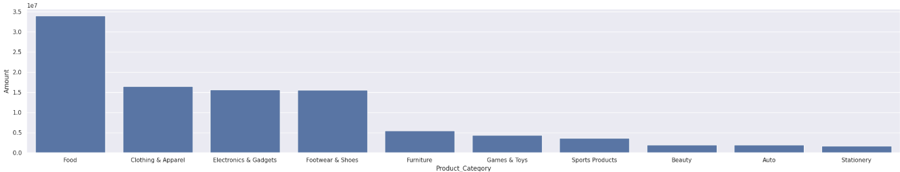
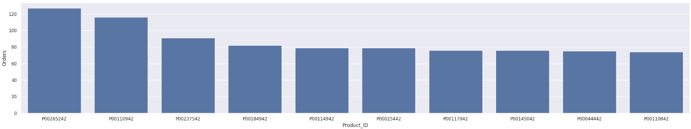

# Diwali Sales Data Analysis

This project performs Exploratory Data Analysis (EDA) on the Diwali sales dataset to gain insights into customer behavior, sales trends, and demographic influences during the Diwali festival.

## Table of Contents

1. [Introduction](#introduction)
2. [Data Preprocessing](#data-preprocessing)
3. [Exploratory Data Analysis](#exploratory-data-analysis-eda)
    - [Gender Analysis](#gender-analysis)
    - [Age Group Analysis](#age-group-analysis)
    - [State Analysis](#state-analysis)
    - [Marital Status Analysis](#marital-status-analysis)
    - [Occupation Analysis](#occupation-analysis)
    - [Product Category Analysis](#product-category-analysis)
4. [Conclusion](#conclusion)
5. [Tools and Technologies](#tools-and-technologies)
6. [Future Work](#future-work)
7. [License](#license)

## Introduction

This project analyzes the sales data during the Diwali season, focusing on different customer demographics and their purchasing patterns. The goal is to uncover insights that can help businesses optimize their sales strategies.

## Data Preprocessing

Before diving into the analysis, the dataset underwent several preprocessing steps:

1. **Loading the Dataset**: The dataset was loaded into a Pandas DataFrame for analysis.
2. **Handling Missing Data**: Columns with missing or irrelevant data were removed.
3. **Data Type Conversion**: The 'Amount' column was converted to an integer type to facilitate numerical operations.
4. **Renaming Columns**: Columns were renamed for clarity, such as changing 'Marital_Status' to 'Shaadi'.

### Data Cleaning Code:

```python
import pandas as pd

# Load data
data = pd.read_csv('Diwali_Sales_Data_Initial.csv', encoding='latin1')

# Drop unnecessary columns
data.drop(['Status','unnamed1'], axis=1, inplace=True)

# Drop rows with missing values
data.dropna(inplace=True)

# Convert 'Amount' to integer type
data['Amount'] = data['Amount'].astype('int')

# Rename columns for better clarity
data.rename(columns={'Marital_Status':'Shaadi'}, inplace=True)
```
## Exploratory Data Analysis (EDA):
Exploratory Data Analysis (EDA) is an essential part of data analysis that helps in understanding the data, uncovering patterns, identifying outliers, and checking assumptions. In this project, we performed EDA on various attributes of the Diwali sales dataset.

## Gender Analysis
We analyzed the total amount spent by each gender to see which gender contributes more to the overall sales. We used a bar plot to visualize the comparison between male and female customers.

### Visualization: Total Sales by Gender


## Age Group Analysis
The next analysis looked at the spending behavior across different age groups. We also visualized the data with the gender split to understand how spending patterns differ between males and females within each age group.

### Visualization: Sales by Age Group and Gender


## State Analysis
We examined which states had the highest number of orders and the highest total sales. This analysis helps in identifying the regions where sales were more concentrated during Diwali.

# Visualization: Total Orders by State


# Visualization: Total Sales by State



## Marital Status Analysis
The marital status of customers was another factor considered in the analysis. We looked at how marital status influences the amount spent and compared the spending patterns between genders.

### Visualization: Sales by Marital Status and Gender



## Occupation Analysis
We analyzed the sales based on customers' occupations, identifying which occupations had the highest spending. This analysis helps businesses target specific occupational groups that may have a higher purchasing power.

### Visualization: Sales by Occupation



## Product Category Analysis
We examined the spending behavior based on product categories, identifying the categories with the highest sales during Diwali.

### Visualization: Top 10 Products by Amount


### Visualization: Top 10 Products by Product_ID



## Conclusion
From the analysis, we observed several key trends:

**Gender:** Women have higher overall sales compared to men during Diwali.
**Age Group:** The age group of 26-35 years contributes significantly to sales, especially for women.
**State:** UP, Maharashtra, and Karnataka are the top contributors to Diwali sales.
**Marital Status:** Married women are more likely to spend during the festive season.
**Occupation:** Occupations in IT, Healthcare, and Aviation have higher purchasing power.
**Product Categories:** Clothing, Food, and Electronics are the most popular categories purchased during Diwali.
These insights can be used to target specific demographics and regions with tailored marketing strategies.

## Tools and Technologies
**Python Libraries:** Pandas, NumPy, Matplotlib, Seaborn
**Data Processing:** Data cleaning, transformation, and analysis
**Visualization:** Bar plots, Count plots

## Future Work
**Machine Learning Models:** Implement predictive models to forecast sales during future Diwali seasons based on historical data.
**Web Dashboard:** Develop an interactive web dashboard to display the analysis and provide real-time insights for decision-making.
**More Data:** Expand the dataset to include additional customer attributes such as income, location, and family size for deeper analysis.


